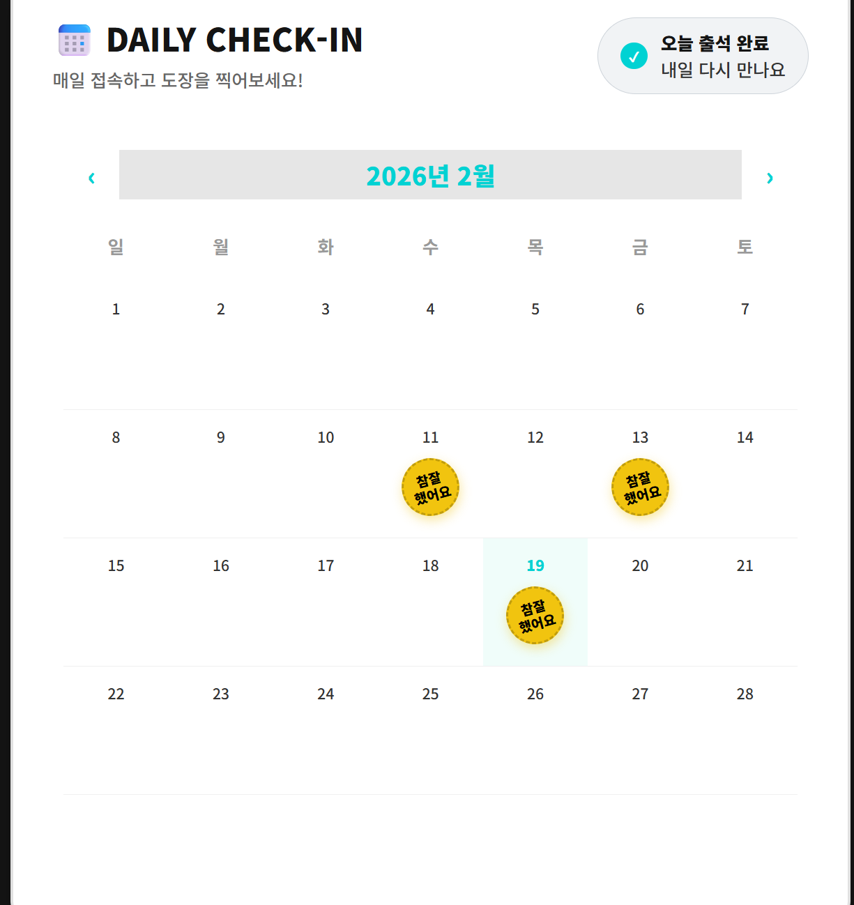
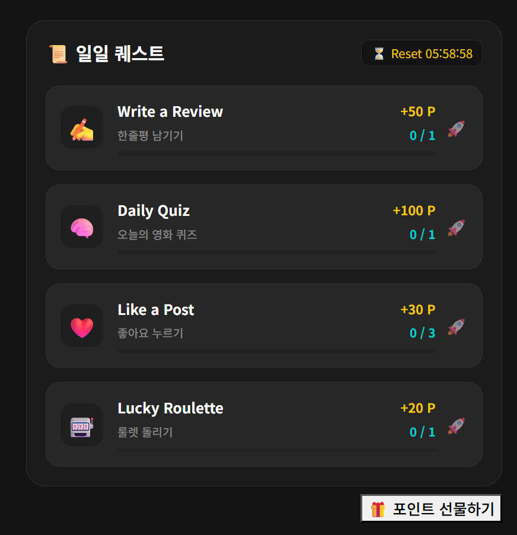
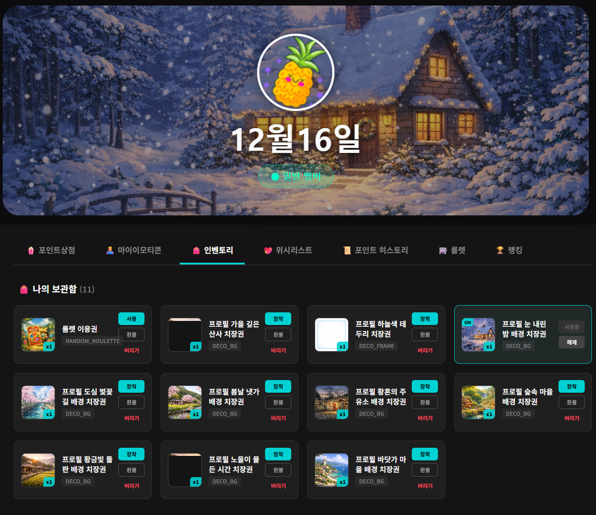
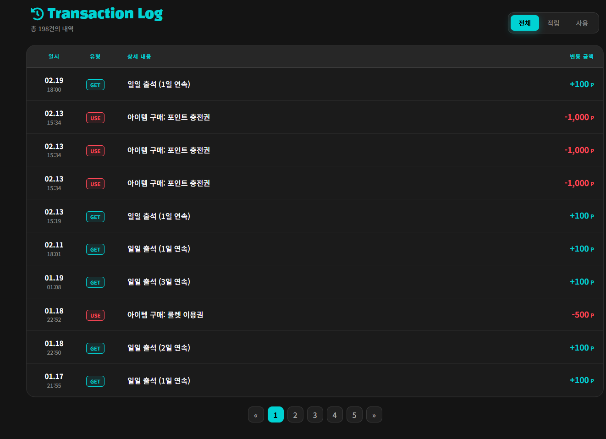
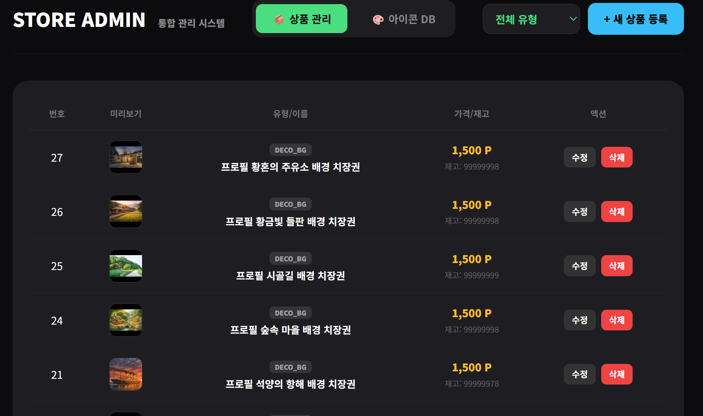

# 🎬 Movie Review Platform — Engagement Point System (Backend)

영화 리뷰 서비스는 “한 번 방문”은 쉬워도 “꾸준한 참여”를 만들기 어렵습니다.  
이 프로젝트는 리뷰/좋아요/출석/퀴즈/룰렛을 **하나의 재화(포인트)** 로 묶어서  
사용자가 다시 돌아오고, 쌓인 포인트를 소비하며, 프로필이 변하는 **반복 루프**를 만들었습니다.

> 참여(행동) → 보상(포인트) → 소비(상점) → 변화(커스터마이징) → 재참여

---

## ✅ 구현 기능(핵심 16개)
- 출석: 체크/달력(연속 출석)
- 퀘스트: 목록/진행도(MERGE)/보상(중복방지)
- 퀴즈: 랜덤 출제/정답 검증
- 룰렛: 티켓 소모 + 랜덤 보상
- 상점: 조회(검색/페이징) / 구매 / 선물
- 위시리스트: 토글/조회
- 인벤토리: JOIN 조회 / 사용(타입 분기) / 장착·해제(타입 단일 장착)
- 이력: 적립·사용 로그 페이징

👉 기능별 **코드/쿼리/무결성/트러블슈팅**은 `detail.md`에 전부 정리했습니다.

---

## 🏗 Architecture

## 📊 ERD

---

## 🧭 화면 흐름(사용자 → 관리자)

1) 출석  

2) 일일 퀘스트/퀴즈  

3) 상점  

4) 인벤토리(프로필 + 보관함)  

5) 포인트 이력  

6) 관리자(상품 관리)  

