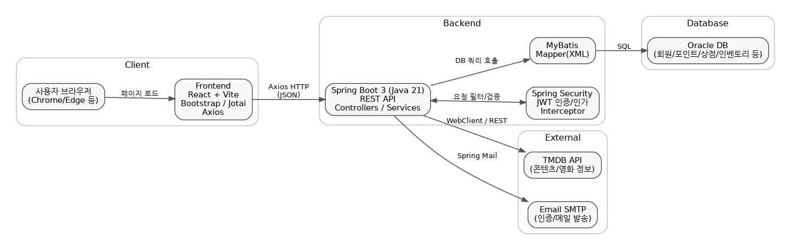
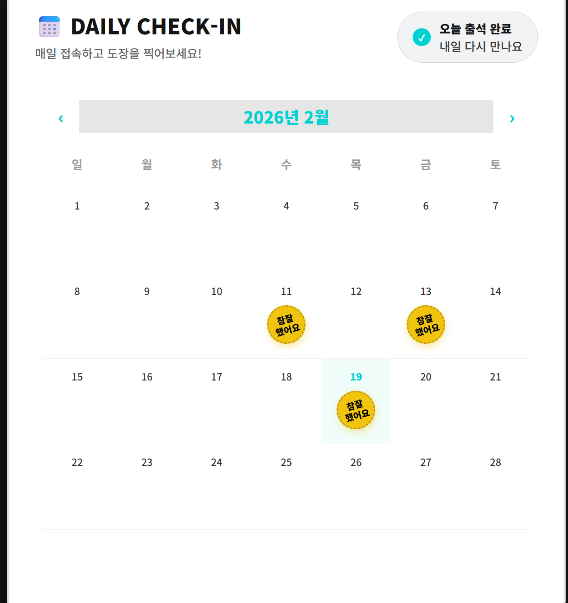
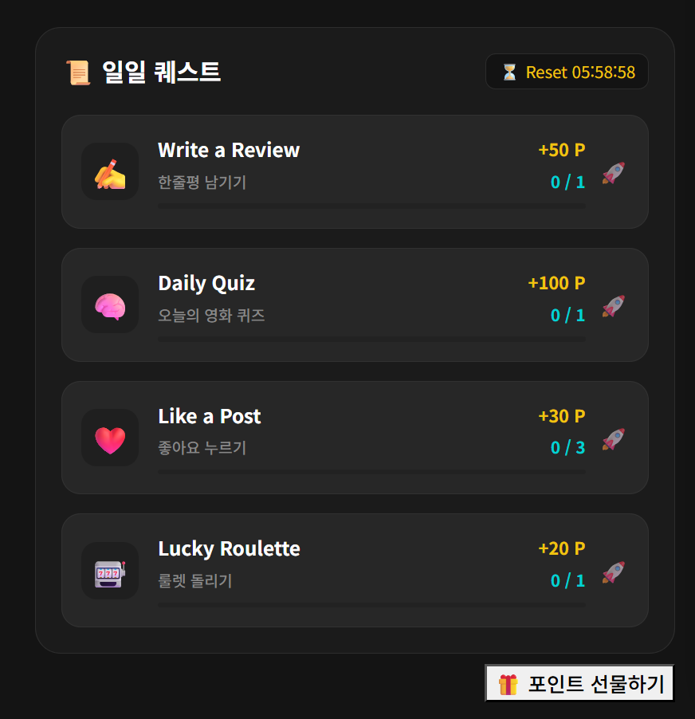
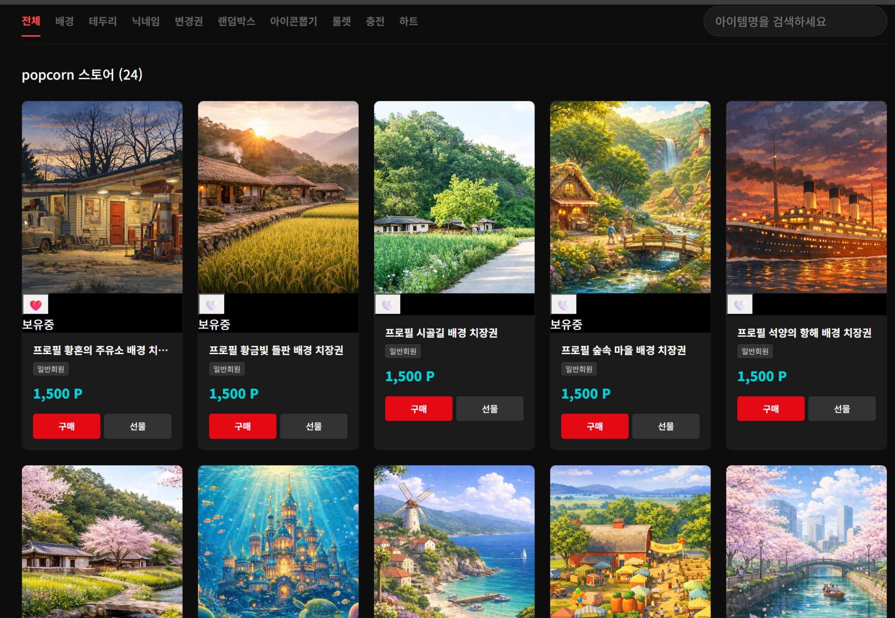
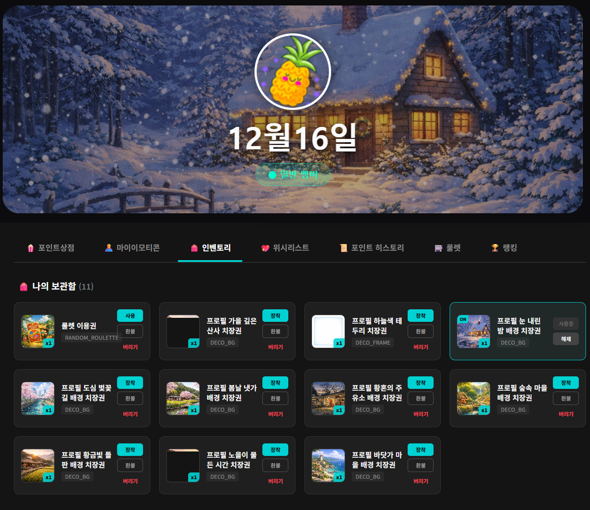
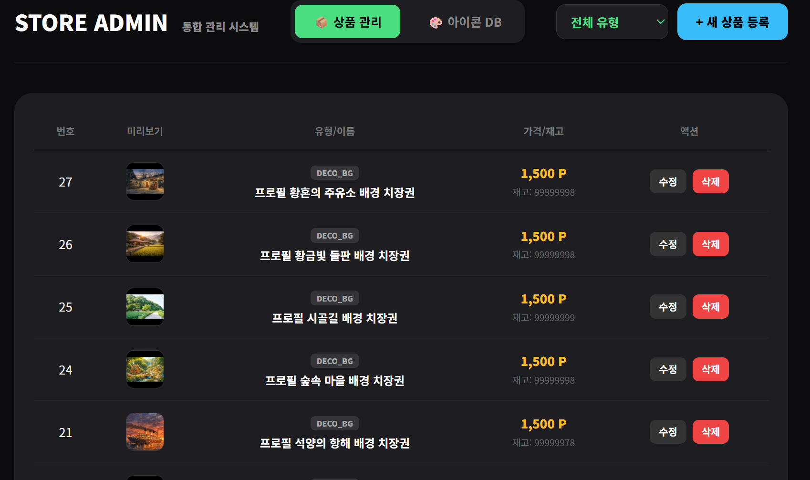

# Review Tag | Backend

Review Tag는 영화·콘텐츠 리뷰 플랫폼입니다. 리뷰, 별점, 가격 평가, 퀴즈, 포인트 기능이 한 서비스 안에서 이어지도록 만든 팀 프로젝트입니다.

백엔드에서는 포인트 도메인 쪽을 맡았습니다. 출석과 퀘스트에서 모은 포인트가 상점, 인벤토리, 이력까지 같은 기준으로 움직이게 만드는 일이 이 파트의 핵심이었습니다.

---

## 프로젝트 소개

- 영화·콘텐츠 리뷰와 가격 평가를 함께 다루는 서비스
- 사용자 활동을 포인트 적립과 소비 경험으로 연결한 구조
- 로그인 사용자 기준으로 출석, 퀘스트, 상점, 인벤토리, 아이콘, 이력, 랭킹 기능 제공

---

## 담당 역할

- 출석, 일일 퀘스트 적립 로직 구현
- 상점 구매, 사용, 환불, 선물 API 구현
- 포인트 잔액과 이력 공통 처리
- 아이콘 뽑기와 장착 흐름 연결
- 관리자 포인트 조정, 상품 관리, 자산 조회 기능 연동

---

## 사용 기술

- Spring Boot
- MyBatis
- Oracle
- JWT
- MVC Pattern
- Git, GitHub

---

## 구현하면서 신경 쓴 점

- 프로젝트 공통 인증 구조 위에서 포인트 API가 같은 방식으로 동작하도록 정리했습니다.
- 포인트 증감과 이력 저장을 같은 기준으로 처리해 화면마다 규칙이 달라지지 않게 했습니다.
- 구매, 환불, 아이템 사용, 관리자 지급도 가능한 범위에서 같은 포인트 규칙 안에서 움직이게 묶었습니다.
- 일일 퀘스트와 보상 수령은 하루 단위 로그 기준으로 중복이 생기지 않게 맞췄습니다.

---

## 구조 및 설계 문서

| 문서 | 설명 |
|---|---|
|  | 컨트롤러, 서비스, DAO가 포인트 도메인 안에서 어떻게 이어지는지 정리한 구조도입니다. |
|  | 포인트 이력, 상점, 인벤토리, 위시리스트, 아이콘, 출석 관련 테이블 관계를 빠르게 볼 수 있는 ERD입니다. |

---

## 대표 화면

| 화면 | 설명 |
|---|---|
|  | 출석 뒤 기록과 포인트가 함께 남아 프론트에서 보는 캘린더와 잔액이 같은 결과를 보여주도록 만든 화면입니다. |
|  | 일일 퀘스트는 하루 기준 진행도와 보상 수령 여부를 따로 관리해 중복 수령이 생기지 않게 정리했습니다. |
|  | 구매 뒤 포인트, 재고, 보관함, 위시 상태가 같이 바뀌도록 서버 로직을 묶어둔 화면입니다. |
|  | 아이템 타입에 따라 사용 방식이 달라서 서버에서 분기 기준을 먼저 정리한 화면입니다. |
|  | 운영 화면에서도 사용자 화면과 다른 규칙이 생기지 않도록 같은 포인트 처리 기준을 타게 맞춘 화면입니다. |

---

## 관련 문서

- [백엔드 상세 정리](docs/Detail-project.md)
- [아키텍처 다이어그램](docs/diagrams/architecture.png)
- [ERD](docs/diagrams/erd.png)
- [화면 상세 설명](docs/screenshots/README.md)

상세 문서에는 출석, 퀘스트, 상점, 인벤토리, 관리자 흐름이 어떤 컨트롤러·서비스·쿼리로 이어지는지와 실제로 막혔던 부분을 같이 정리해두었습니다.