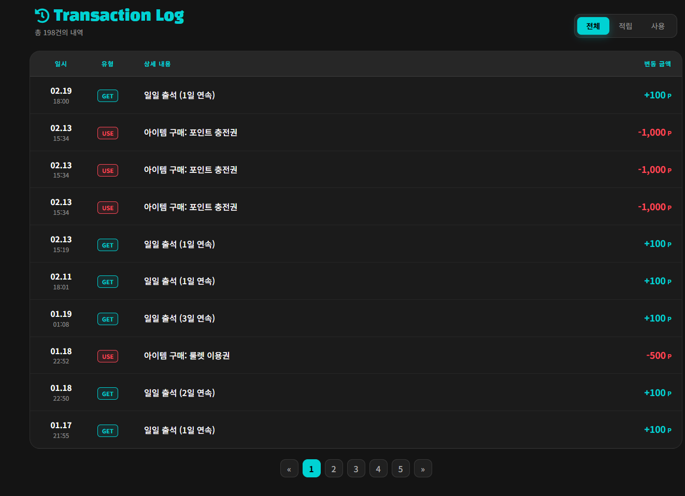

# Review Tag Backend | 화면별 백엔드 역할 및 상세 설명

이 문서는 포인트 시스템의 실제 화면 흐름과 그 이면에서 동작하는 백엔드의 역할을 스크린샷과 함께 직관적으로 정리한 문서입니다. 눈에 보이는 화면은 프론트엔드의 영역이지만, 각 화면이 정상적으로 동작하기 위해 백엔드에서 어떤 데이터를 처리하고 책임을 지고 있는지 매핑하여 작성했습니다.

## 읽는 순서

1. 출석과 일일 퀘스트 적립
2. 상점 구매와 인벤토리 사용
3. 포인트 이력 확인
4. 관리자 운영 화면

---

## 01. 출석

### 화면 설명
하루 한 번 출석 체크를 하고 도장을 확인하는 화면입니다.

### 이 화면을 위해 정리한 백엔드 기능
- 오늘 이미 출석했는지 확인
- 연속 출석 일수 계산
- 출석 기록 저장
- 포인트 지급과 이력 저장

### 연결 흐름
`AttendanceRestController` → `AttendanceService.checkAttendance()` → `PointService.addPoint()`

---

## 02. 일일 퀘스트 / 퀴즈

### 화면 설명
오늘 진행할 수 있는 퀘스트와 보상 상태를 보여주는 화면입니다.

### 이 화면을 위해 정리한 백엔드 기능
- 오늘 기준 퀘스트 로그 조회
- 진행도 계산
- 보상 중복 수령 방지
- 퀴즈 정답 검증 후 보상 지급

### 연결 흐름
`DailyQuestRestController` → `DailyQuestService` → `POINT_GET_QUEST_LOG` / `PointService.addPoint()`

---

## 03. 상점

### 화면 설명
포인트로 상품을 구매하는 화면입니다.

### 이 화면을 위해 정리한 백엔드 기능
- 상품 존재 여부 확인
- 재고 확인
- 포인트 차감
- 인벤토리 지급
- 위시리스트 정리

### 연결 흐름
`PointStoreRestController.buy()` → `PointService.purchaseItem()`

---

## 04. 인벤토리

### 화면 설명
보유 중인 아이템을 실제로 사용하는 화면입니다.

### 이 화면을 위해 정리한 백엔드 기능
- 아이템 타입별 사용 로직 분기
- 장착형 아이템 단일 활성화
- 환불 / 삭제 처리
- 랜덤 아이템, 닉네임 변경권 처리

### 연결 흐름
`PointStoreRestController.useItem()` → `PointService.useItem()`

---

## 05. 포인트 이력

### 화면 설명
포인트가 어디서 적립되고 차감됐는지 확인하는 화면입니다.

### 이 화면을 위해 정리한 백엔드 기능
- 출석, 퀘스트, 구매, 환불, 관리자 지급처럼 여러 기능에서 생긴 값을 한 이력 테이블에 남기기
- 금액과 사유가 함께 저장되도록 공통 처리 기준 유지

### 연결 흐름
`PointService.addPoint()` → `point_history`

---

## 06. 관리자 화면

### 화면 설명
운영자가 상품과 포인트를 관리하는 화면입니다.

### 이 화면을 위해 정리한 백엔드 기능
- 관리자 포인트 지급 / 회수
- 상품 등록 / 수정 / 삭제
- 회원 자산 조회
- 운영 기능도 사용자 포인트와 같은 기준으로 처리

### 연결 흐름
`AdminRestController` → `PointService.adminUpdatePoint()` / 상품 관리 DAO

---

## 짧게 정리하면

포인트 도메인은 겉보기엔 화면이 많아 복잡해 보이지만, 핵심은 **여러 화면이 결국 같은 잔액과 변동 이력을 건드린다**는 사실입니다. 이 문서는 다양한 화면에서 시작된 포인트 흐름이 백엔드 단에서 어떻게 이어지고 관리되는지 빠르게 훑어보기 위한 정리본입니다.
